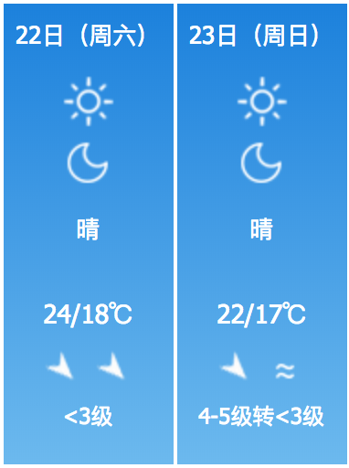

# 天津自驾公路

### 天津景点
|景点|位置|类别|时间|价格|备注|
|----|----|---|---|---|--|
|摩天轮|天津市河北区三岔河口永乐桥上|玩|夜间|70|人多排队，提前网上订票|
|海河游船||玩|夜间|100||
|意大利风情区|天津市河北区天津河北区自由道25号|逛|夜间最佳|免费||
|五大道|天津市和平区重庆道83号|逛|白天|免费||
|石头门坎素包店|南市食品街店|吃||人均15||
|老六涮羊肉|辽宁路店|吃||人均74||
|红旗饭庄|河西店|吃||人均75||
|名流茶馆||听相声||||
 
### 吃住玩组合
1. 摩天轮 海河游船 2选一 + 相声
2. 中午 红旗饭庄 ，中间小吃，晚上涮肉，第二天 狗不理
3. 住宿方便 提前选择住宿地址就行
### 路线

### 行程表
	
### 注意事项

#### 车辆
    1. 车辆检测
#### 天气

#### 人
    1. 证件： 身份证 驾驶证 